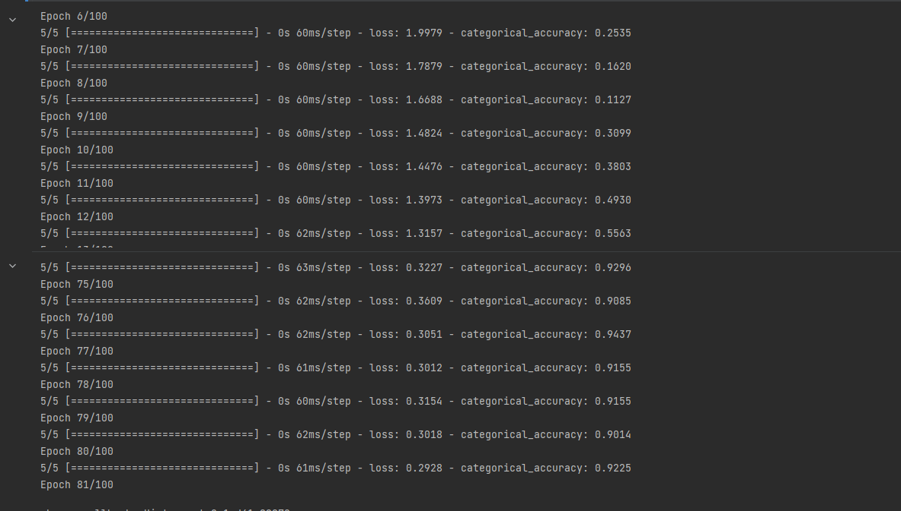

# Sign Language Recognition by using Tensorflow, MediaPipe and OpenCV

## Introduction

- Video: https://www.youtube.com/watch?v=hTiYJZq2ifI

To begin with, I would like to describe the essence of the problem that gave rise to the idea. A certain circle of people do not have the opportunity to communicate in words, and we cannot understand them.
The idea involves recognizing the sign language shown by a person.

Turning to the reference that was used, there were videos on YouTube. In particular, a video from the creator "Nicholas Renotte".

To be honest, his videos in which he not only shows how to create a certain model and train it, but also explains the concepts and how they work together.

The work I recreated was moments remade from his videos. I did certain things as I understood myself, but I also spied on the moments related mostly to the OpenCV and Mediapipe libraries from him.

---

## Data and methods

Data collection for the model was carried out via a laptop webcam, using OpenCV and for Mediapipe keypoints, as already described earlier. The data was collected in a numpy array and also when a certain part of the body was not found, it was filled with zeros.

### Keypoints

### Model train

## 

As mentioned earlier, the model was trained by me using a webcam and sign language. Speaking of theory, the OpenCV library was used to use the camera, and MediaPipe to get points and draw mesh.

Mediapipe is a framework for launching pipelines (preprocessing data, launching models (output), as well as postprocessing model results) of machine learning, which allows you to solve the problems described above and simplifies writing cross-platform code for launching models.

# Results

For the results, I trained the model in 100 epochs using the Adamax optimizer.
As a result of which it turned out to teach her 95%.

# Critical Review

Being critical of the project, I would like to say that it was probably a little early for us to learn something abstract in machine learning, because there were solutions using other libraries such as "pandas".
And the solution that I provided, it is not fully recreated by me, because the knowledge gained was not enough. I would like to get more practical lessons in the future where we could clearly explain what is used and for what.

## Sources:

- YouTube: https://www.youtube.com/@NicholasRenotte
- Mediapipe: https://google.github.io/mediapipe/solutions/solutions
